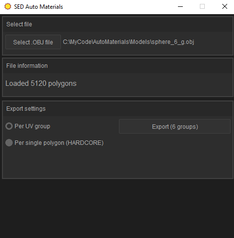

# SED Auto Materials
Небольшая утилита для подготовки мешей (.obj) к импорту в Serious Modeller (речь идет о первом движке. Serious Engine 1).

По каким-то таинственным, мистическим, и возномжно даже ебанистическим причинам, для  того чтобы на импортированных в Serious Modeller мешах не плыла текстура, необходимо чтобы каждая группа полигонов (которая создается при UV развертке) соответствовала отдельному материалу (при этом также важно чтобы угол между нормалями полигонов одной группы не превышал 90 градусов).

Этот нюанс значительно усложняет жизнь тем, кто решил что-нибудь помоделировать для первого Сэма, поскольку приходится руками для каждой UV группы создавать отдельный материал. Если групп много, процесс может растягиваться на часы. 

Даннная программа позволяет автоматизировать этот процесс. Программа работает с .OBJ файлами, которые хорошо воспринимаются Serious Modeller'ом. Чтобы поделить геометрию на материалы необходимо чтобы у модели была сделана UV развертка (с учетом правила об углах не превушающих 90 градусов). Каждой UV группе будет назначен отдельный материал. Также, если вы решили пуститься во все тяжкие, есть опция "материал на каждый полигон". Но это ХАРДКОР, не рекомендуется к использованию.

В репозитории присутствуют 2 версии : консольная и GUI (с графическим интерфейсом)

Писалось и тестировалось при помощи следующего набора инструментов
 - CLion + CMake (IDE, система сборки)
 - MinGW 8.1.0 / MSVC 2019 (Компиляция и сборка)

